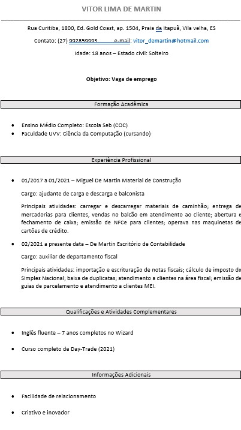

<!DOCTYPE html>
<html lang="pt-br">
<head>
    <meta charset="UTF-8">
    <meta http-equiv="X-UA-Compatible" content="IE=edge">
    <meta name="viewport" content="width=device-width, initial-scale=1.0">
    <title>Curriculo Vitor De Martin</title>
    <!-- CSS only -->
<link href="https://cdn.jsdelivr.net/npm/bootstrap@5.1.3/dist/css/bootstrap.min.css" rel="stylesheet" integrity="sha384-1BmE4kWBq78iYhFldvKuhfTAU6auU8tT94WrHftjDbrCEXSU1oBoqyl2QvZ6jIW3" crossorigin="anonymous">
    <link rel="stylesheet" href="assets/CSS/style.css">
</head>
    <body>

    
  
        
            <h1>Vitor De Martin</h1>
            

                
                
            

            

                
        
            

            
            
        
        

            

                informações de contato
            

            <ul class="list-group list-group-flush">
              <li class="list-group-item">Telefone: 27 99285-9993</li>
              <li class="list-group-item">E-mail: vitor_demartin@hotmail.com</li>
              
            </ul>
          

        
    

   
    </body>

<!-- JavaScript Bundle with Popper -->

</html>
